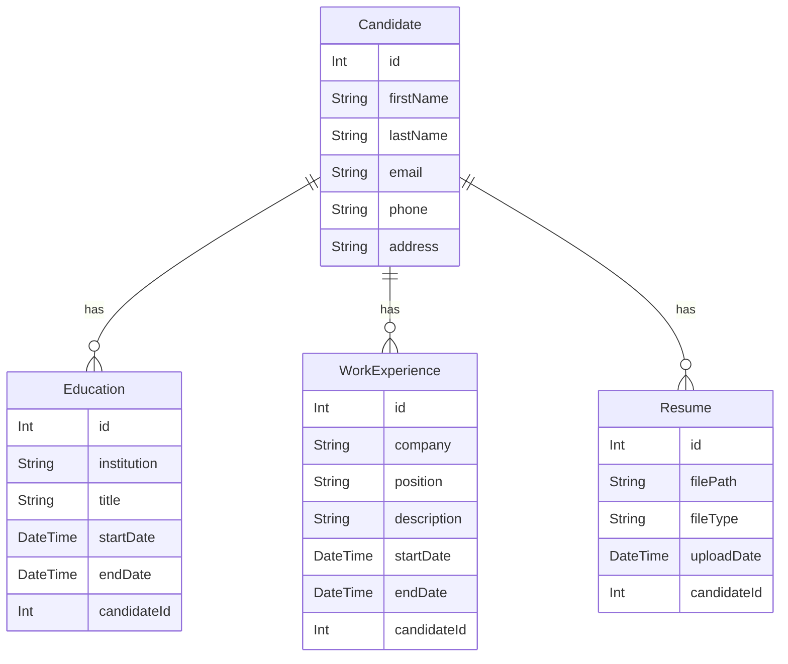

# Documento del Modelo de Datos para el Proyecto LTI

## Descripción General
Este documento describe el modelo de datos utilizado en el backend del proyecto LTI, que gestiona la información relacionada con el proceso de reclutamiento, incluyendo candidatos, posiciones, entrevistas y más.

## Modelos Principales

### Candidate
- **Descripción**: Representa a un individuo que aplica a una posición.
- **Campos**:
  - id: Identificador único del candidato.
  - firstName: Nombre del candidato.
  - lastName: Apellido del candidato.
  - email: Correo electrónico del candidato.
  - phone: Teléfono del candidato.
  - address: Dirección del candidato.
  - educations: Relación con educaciones del candidato.
  - workExperiences: Relación con experiencias laborales del candidato.
  - resumes: Relación con currículums del candidato.
  - applications: Relación con aplicaciones a posiciones.

### Education
- **Descripción**: Detalles educativos de un candidato.
- **Campos**:
  - id: Identificador único de la educación.
  - institution: Nombre de la institución educativa.
  - title: Título obtenido.
  - startDate: Fecha de inicio.
  - endDate: Fecha de finalización.
  - candidate: Relación con el candidato asociado.

### WorkExperience
- **Descripción**: Experiencias laborales previas de un candidato.
- **Campos**:
  - id: Identificador único de la experiencia laboral.
  - company: Nombre de la empresa.
  - position: Cargo ocupado.
  - description: Descripción de las responsabilidades y logros.
  - startDate: Fecha de inicio.
  - endDate: Fecha de finalización.
  - candidate: Relación con el candidato asociado.

### Resume
- **Descripción**: Archivos de currículum subidos por el candidato.
- **Campos**:
  - id: Identificador único del currículum.
  - filePath: Ruta del archivo almacenado.
  - fileType: Tipo de archivo.
  - uploadDate: Fecha de carga del archivo.
  - candidate: Relación con el candidato asociado.

## Relaciones
- **Candidato a Educación**: Un candidato puede tener múltiples registros de educación.
- **Candidato a Experiencia Laboral**: Un candidato puede tener múltiples experiencias laborales.
- **Candidato a Currículum**: Un candidato puede tener múltiples currículums.

## Diagrama mermaid



## Uso de Prisma
El modelo de datos se implementa utilizando Prisma, un ORM para Node.js. Prisma facilita la interacción con la base de datos PostgreSQL y maneja las relaciones entre los modelos de manera eficiente.

### Ejemplo de Consulta con Prisma
Para obtener un candidato y sus detalles relacionados, se podría usar una consulta como la siguiente:
```typescript
const candidateDetails = await prisma.candidate.findUnique({
  where: { id: 1 },
  include: {
    educations: true,
    workExperiences: true,
    resumes: true
  }
});
```

Este documento proporciona una visión general del diseño del modelo de datos utilizado en el backend del proyecto LTI, esencial para el manejo eficiente de los datos dentro de la aplicación.